# FitFindr — planning.md

> Complete this document before writing any implementation code.
> Your spec and agent diagram are what you'll use to direct AI tools (Claude, Copilot, etc.) to generate your implementation — the more specific they are, the more useful the generated code will be.
> Your planning.md will be reviewed as part of your submission.
> Update it before starting any stretch features.

---

## Tools

List every tool your agent will use. For each tool, fill in all four fields.
You must have at least 3 tools. The three required tools are listed — add any additional tools below them.

### Tool 1: search_listings

**What it does:**
<!-- Describe what this tool does in 1–2 sentences -->
When the agent calls this tool, it loads all the listings from load_listings(). It searches for items matching the users query (parameters) and returns a list of matching listing dictionaries - returns nothing if no matching listings are found. 

**Input parameters:**
<!-- List each parameter, its type, and what it represents -->
- `description` (str): The description represents the keywords of what the user is looking for
- `size` (str): User's requested size
- `max_price` (float): Maximum price user wishes to spend

**What it returns:**
<!-- Describe the return value — what fields does a result contain? -->
This function returns listings that match what the user is looking for (parameters). The listings are sorted by relevance. Results contain these fields: id, title, description, category, style_tags (list), size, condition, price (float), colors (list), brand, platform

**What happens if it fails or returns nothing:**
The tool returns an empty list if there are no matches. No exceptions are raised.

---

### Tool 2: suggest_outfit

**What it does:**
<!-- Describe what this tool does in 1–2 sentences -->
This function is given a listing dictionary and the user's wardrobe. It creates specific outfit combinations from the listing dictionary and the user's wardrobe and returns that as a string.  

**Input parameters:**
<!-- List each parameter, its type, and what it represents -->
- `new_item` (dict): A listing dictionary - item the user is considering buying
- `wardrobe` (dict): The user's wardrobe - consisting of lists of wardrobe item dicts

**What it returns:**
<!-- Describe the return value -->
The function returns a string containing outfit suggestions. 

**What happens if it fails or returns nothing:**
<!-- What should the agent do if the wardrobe is empty or no outfit can be suggested? -->
The failure happens when the wardrobe is empty. Instead of returning nothing, the LLM offers general styling advice for user's requested item. 

---

### Tool 3: create_fit_card

**What it does:**
<!-- Describe what this tool does in 1–2 sentences -->
The function takes in the outfit suggestion string from suggest_outfit() and and the listing dictionary. It returns a 2-4 sentence string that serves as a social media caption that describes the outfit's attributes

**Input parameters:**
<!-- List each parameter, its type, and what it represents -->
- `outfit` (str): The outfit string from suggest_outfit()
- 'new_item' (dict): The listings dictionary related to what the user intends to buy

**What it returns:**
<!-- Describe the return value -->
Returns a 2-4 sentence string that fits a social media caption that describes the outfit.

**What happens if it fails or returns nothing:**
<!-- What should the agent do if the outfit data is incomplete? -->
If the outfit string is missing or incomplete, the tool outputs a descriptive error message.

---

### Tool 4: compare_price

**What it does:**
Given a listing dict, it loads all listings, finds comparable items (same category with overlapping style tags, falling back to same category only), computes price statistics, and returns a human-readable string stating whether the item is a great deal, fairly priced, or potentially overpriced.

**Input parameters:**
- `item` (dict): A listing dictionary — must include at least `price`, `category`, and `style_tags`

**What it returns:**
A string containing a verdict (great deal / fair price / potentially overpriced), the number of comparable listings used, and summary statistics (average, median, min–max range).

**What happens if it fails or returns nothing:**
If the item has no `price` field, returns a descriptive error string. If no comparable listings exist in the dataset for the item's category, returns a "no comparables found" message. Neither case raises an exception.

---

### Tool 5: load_style_profile

**What it does:**
Loads a persisted style profile for a given user from a JSON file stored at `profiles/{user_id}.json`. Returns the profile dict containing the user's known preferences so the agent can pre-fill defaults without requiring the user to describe their wardrobe from scratch.

**Input parameters:**
- `user_id` (str): A stable identifier for the user (e.g., a username or UUID)

**What it returns:**
A dict with the following keys:
- `preferred_colors` (list[str]): Colors the user has gravitated toward in past sessions
- `preferred_styles` (list[str]): Style tags that appear repeatedly in items the user has selected
- `preferred_size` (str | None): The size the user most commonly filters by
- `max_budget` (float | None): The price ceiling the user most commonly sets
- `preferred_brands` (list[str]): Brands that have shown up in past selections
- `wardrobe_summary` (str): A plain-English summary of the user's wardrobe, built up over sessions
- `session_count` (int): Total number of past sessions for this user

If no profile file exists yet, returns a fresh empty profile with all lists empty and numeric fields set to None.

**What happens if it fails or returns nothing:**
If the file is unreadable or malformed JSON, the tool returns the same empty profile dict it would return for a new user — it never raises an exception. The session continues normally; any preference data that can't be loaded is simply absent.

---

### Tool 6: save_style_profile

**What it does:**
Persists or updates a user's style profile to disk after a completed session. Merges signals extracted from the session (selected item's colors, style tags, size, price) into the existing profile dict, increments `session_count`, and writes the updated profile back to `profiles/{user_id}.json`. This is how the agent "learns" over time.

**Input parameters:**
- `user_id` (str): The same identifier passed to `load_style_profile`
- `session` (dict): The completed session dict returned by `run_agent()` — must contain at least `selected_item`, `parsed`, and the profile already loaded at session start

**What it returns:**
A short confirmation string (e.g., `"Style profile updated (session 4)."`) or a descriptive error string if the write fails. Never raises an exception.

**What happens if it fails or returns nothing:**
If the `profiles/` directory doesn't exist or the write fails due to a permissions error, the tool returns a descriptive error string and the session continues — profile persistence is best-effort and must not crash the agent.

---

### Additional Tools (if any)

<!-- Copy the block above for any tools beyond the required three -->

---

## Planning Loop

**How does your agent decide which tool to call next?**
<!-- Describe the logic your planning loop uses. What does it look at? What conditions change its behavior? How does it know when it's done? -->
At the start of every session, the agent calls `load_style_profile(user_id)` to retrieve the user's saved preferences. It then parses the query for an explicit description, size, and max_price, falling back to the profile's `preferred_size` and `max_budget` for any field the user did not specify. Next it calls `search_listings` with the merged parameters. If it returns an empty list, the loop ends early. If it returns results, the agent picks the top item, calls `compare_price`, then calls `suggest_outfit` — using the profile's `wardrobe_summary` as supplementary context when the passed-in wardrobe is empty. The agent then calls `create_fit_card`. If the outfit string is missing or malformed, the tool returns an error and the session terminates. On success, the agent calls `save_style_profile(user_id, session)` to merge the selected item's signals (colors, style tags, size, price) into the stored profile before the session terminates.

---

## State Management

**How does information from one tool get passed to the next?**
<!-- Describe how your agent stores and accesses state within a session. What data is tracked? How is it passed between tool calls? -->
The agent holds all state in a single in-memory `session` dict. At session start, the profile loaded by `load_style_profile` is stored in `session["profile"]`; any preferences it contains are merged into `session["parsed"]` before `search_listings` is called. The listing dict returned by `search_listings` is stored as `session["selected_item"]` and forwarded directly into `suggest_outfit` and `create_fit_card`. The outfit string is stored as `session["outfit_suggestion"]` and passed immediately into `create_fit_card`. At session end, `save_style_profile` reads `session["selected_item"]` and `session["parsed"]` to extract new signals and writes the updated profile to `profiles/{user_id}.json`. Cross-session persistence lives exclusively in that JSON file; within a session, everything passes through the dict. No copies are made — each tool receives a direct reference to the same object.

---

## Error Handling

For each tool, describe the specific failure mode you're handling and what the agent does in response.

| Tool | Failure mode | Agent response |
|------|-------------|----------------|
| search_listings | No results match the query | Returns an empty list and terminates session |
| suggest_outfit | Wardrobe is empty | Agent outputs general styling advice generated by the LLM; profile's `wardrobe_summary` is appended to the prompt as extra context |
| create_fit_card | Outfit input is missing or incomplete | Agent returns a descriptive error message and terminates session |
| compare_price | Item has no price, or no comparable listings exist | Returns a descriptive error/info string; agent surfaces it to the user and continues to suggest_outfit |
| load_style_profile | File missing or malformed JSON | Returns an empty default profile; session continues as if it were a first-time user |
| save_style_profile | `profiles/` directory missing or write permission denied | Returns a descriptive error string; session result is still returned to the caller — persistence failure does not abort the session |

---

## Architecture

<!-- Draw a diagram of your agent showing how the components connect:
     User input → Planning Loop → Tools (search_listings, suggest_outfit, create_fit_card)
                                                                          ↕
                                                                   State / Session
     Show what triggers each tool, how state flows between them, and where error paths branch off.
     ASCII art, a Mermaid diagram (https://mermaid.js.org/syntax/flowchart.html), or an embedded
     sketch are all fine. You'll share this diagram with an AI tool when asking it to implement
     the planning loop and each individual tool. -->

```mermaid
---
config:
  layout: elk
---
flowchart TD
    Start([Agent Starts]) --> LoadProfile[Call load_style_profile\nfor user_id]
    LoadProfile --> ProfileLoaded[(Profile loaded\nor empty default)]
    ProfileLoaded --> CheckQuery{User expresses\ninterest in item?}
    CheckQuery -->|No| End1([Session Ends])
    CheckQuery -->|Yes| MergeParams[Merge query params\nwith profile defaults]
    MergeParams --> SearchListings[Call search_listings\nwith merged parameters]
    SearchListings --> CheckResults{Results\nempty?}
    CheckResults -->|Yes| NoMatches[Tell user no matches found]
    NoMatches --> End2([Loop Ends])
    CheckResults -->|No| ComparePrice[Call compare_price\nwith top listing]
    ComparePrice --> PriceAssessment[Show price assessment\nto user]
    PriceAssessment --> SuggestOutfit[Call suggest_outfit\nwith listings, wardrobe &\nprofile wardrobe_summary]
    SuggestOutfit --> CheckWardrobe{Wardrobe\nempty?}
    CheckWardrobe -->|Yes| GeneralAdvice[LLM generates general\nstyling advice using\nprofile wardrobe_summary]
    CheckWardrobe -->|No| OutfitSuggestion[Agent receives\noutfit suggestion]
    GeneralAdvice --> CreateFitCard
    OutfitSuggestion --> CreateFitCard[Call create_fit_card\nwith outfit string & listings]
    CreateFitCard --> CheckOutfit{Outfit string\nvalid?}
    CheckOutfit -->|Invalid/Deformed| ErrorMsg[Return error message]
    ErrorMsg --> End3([Session Ends])
    CheckOutfit -->|Valid| FitCardString[Receive fit card string]
    FitCardString --> SaveProfile[Call save_style_profile\nmerge item signals into profile]
    SaveProfile --> ProfileFile[(profiles/user_id.json\nupdated on disk)]
    ProfileFile --> OutputUser[Output fit card to user]
    OutputUser --> End4([Session Terminates])

    classDef processNode stroke:#818cf8,fill:#eef2ff
    classDef decisionNode stroke:#fb923c,fill:#fff7ed
    classDef successNode stroke:#4ade80,fill:#f0fdf4
    classDef errorNode stroke:#f87171,fill:#fef2f2
    classDef endNode stroke:#38bdf8,fill:#f0f9ff
    classDef storageNode stroke:#a78bfa,fill:#f5f3ff

    class SearchListings,ComparePrice,PriceAssessment,SuggestOutfit,CreateFitCard,GeneralAdvice,OutfitSuggestion,FitCardString,LoadProfile,SaveProfile,MergeParams processNode
    class CheckQuery,CheckResults,CheckWardrobe,CheckOutfit decisionNode
    class NoMatches,ErrorMsg errorNode
    class OutputUser successNode
    class Start,End1,End2,End3,End4 endNode
    class ProfileLoaded,ProfileFile storageNode
```

---

## AI Tool Plan

<!-- For each part of the implementation below, describe:
     - Which AI tool you plan to use (Claude, Copilot, ChatGPT, etc.)
     - What you'll give it as input (which sections of this planning.md, your agent diagram)
     - What you expect it to produce
     - How you'll verify the output matches your spec before moving on

     "I'll use AI to help me code" is not a plan.
     "I'll give Claude my Tool 1 spec (inputs, return value, failure mode) and ask it to implement
     search_listings() using load_listings() from the data loader — then test it against 3 queries
     before trusting it" is a plan. -->

**Milestone 3 — Individual tool implementations:**
I will give Claude my tool specs - inputs, return values, failure mode, and ask it to implement these functions: search_listings(), suggest_outfit(), and create_fit_card() using the tools from data_loader.py. I will test each tool individually with at least 3 queries and make sure they produce accurate results before moving on to subsequent tools.

**Milestone 4 — Planning loop and state management:**
I will give Claude my planning loop diagram - which contains all of the tools and fallbacks for invalid inputs/outputs. I will have it implement the planning loop and build the user interface. Before trusting the results, I will test several queries to ensure complete interactions are happening between the user and the agent and that session states are being passed correctly.

**Milestone 5 — Style profile memory:**
I will give Claude the Tool 5 and Tool 6 specs (inputs, return values, storage format, failure modes) and ask it to implement `load_style_profile()` and `save_style_profile()` in `tools.py`. I will test with at least two simulated sessions: first session creates the file; second session loads it and verifies that a missing size or budget is filled from the stored profile. I will verify by inspecting the JSON file on disk and asserting that `session["parsed"]` contains the profile defaults when they are not present in the raw query. I will also test that a write failure (by making the directory read-only) returns an error string without crashing the agent.

---

## A Complete Interaction (Step by Step)

Write out what a full user interaction looks like from start to finish — tool call by tool call. Use a specific example query.

**Example user query:** "I'm looking for a vintage graphic tee. What's out there and how would I style it?"
(Note: no size or budget specified — these will be filled from the stored profile.)

**Step 1:**
The agent calls `load_style_profile(user_id="victor")`. The stored profile returns `preferred_size="M"`, `max_budget=30.0`, and `wardrobe_summary="baggy jeans, chunky sneakers, oversized hoodies"` from a prior session.

**Step 2:**
The agent parses the raw query: `description="vintage graphic tee"`, `size=None`, `max_price=None`. It merges the profile defaults, producing `size="M"` and `max_price=30.0`. It calls `search_listings(description="vintage graphic tee", size="M", max_price=30.0)` and receives a non-empty list (e.g., a faded band tee, a retro logo tee).

**Step 3:**
The agent picks the top result and calls `compare_price(item=<listing dict>)`, which returns a fair-price verdict. The agent calls `suggest_outfit(new_item=<listing dict>, wardrobe=user_wardrobe)`, passing the user's current wardrobe (or falling back to the profile's `wardrobe_summary` if the wardrobe dict is empty) to generate specific outfit combinations.

**Step 4:**
suggest_outfit returns an outfit string. The agent passes it to `create_fit_card(outfit=<suggestion string>, new_item=<listing dict>)` to produce the social-media caption.

**Step 5:**
The agent calls `save_style_profile(user_id="victor", session=session)`. The selected item's colors (e.g., "black", "white") and style tags (e.g., "vintage", "streetwear") are merged into the existing profile, and `session_count` is incremented to 2. The updated JSON is written to `profiles/victor.json`.

**Final output to user:**
The user sees a 2–4 sentence fit card caption describing the vintage tee styled with their baggy jeans and chunky sneakers — without ever having to re-describe their wardrobe. If no matches were found in Step 2, the agent instead tells the user no listings were available and ends the session without saving.