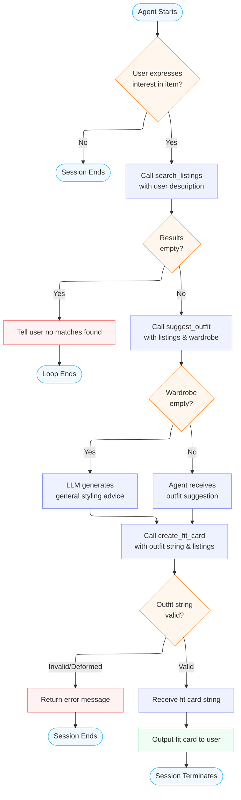

# FitFindr — planning.md

> Complete this document before writing any implementation code.
> Your spec and agent diagram are what you'll use to direct AI tools (Claude, Copilot, etc.) to generate your implementation — the more specific they are, the more useful the generated code will be.
> Your planning.md will be reviewed as part of your submission.
> Update it before starting any stretch features.

---

## Tools

List every tool your agent will use. For each tool, fill in all four fields.
You must have at least 3 tools. The three required tools are listed — add any additional tools below them.

### Tool 1: search_listings

**What it does:**
<!-- Describe what this tool does in 1–2 sentences -->
When the agent calls this tool, it loads all the listings from load_listings(). It searches for items matching the users query (parameters) and returns a list of matching listing dictionaries - returns nothing if no matching listings are found. 

**Input parameters:**
<!-- List each parameter, its type, and what it represents -->
- `description` (str): The description represents the keywords of what the user is looking for
- `size` (str): User's requested size
- `max_price` (float): Maximum price user wishes to spend

**What it returns:**
<!-- Describe the return value — what fields does a result contain? -->
This function returns listings that match what the user is looking for (parameters). The listings are sorted by relevance. Results contain these fields: id, title, description, category, style_tags (list), size, condition, price (float), colors (list), brand, platform

**What happens if it fails or returns nothing:**
The tool returns an empty list if there are no matches. No exceptions are raised.

---

### Tool 2: suggest_outfit

**What it does:**
<!-- Describe what this tool does in 1–2 sentences -->
This function is given a listing dictionary and the user's wardrobe. It creates specific outfit combinations from the listing dictionary and the user's wardrobe and returns that as a string.  

**Input parameters:**
<!-- List each parameter, its type, and what it represents -->
- `new_item` (dict): A listing dictionary - item the user is considering buying
- `wardrobe` (dict): The user's wardrobe - consisting of lists of wardrobe item dicts

**What it returns:**
<!-- Describe the return value -->
The function returns a string containing outfit suggestions. 

**What happens if it fails or returns nothing:**
<!-- What should the agent do if the wardrobe is empty or no outfit can be suggested? -->
The failure happens when the wardrobe is empty. Instead of returning nothing, the LLM offers general styling advice for user's requested item. 

---

### Tool 3: create_fit_card

**What it does:**
<!-- Describe what this tool does in 1–2 sentences -->
The function takes in the outfit suggestion string from suggest_outfit() and and the listing dictionary. It returns a 2-4 sentence string that serves as a social media caption that describes the outfit's attributes

**Input parameters:**
<!-- List each parameter, its type, and what it represents -->
- `outfit` (str): The outfit string from suggest_outfit()
- 'new_item' (dict): The listings dictionary related to what the user intends to buy

**What it returns:**
<!-- Describe the return value -->
Returns a 2-4 sentence string that fits a social media caption that describes the outfit.

**What happens if it fails or returns nothing:**
<!-- What should the agent do if the outfit data is incomplete? -->
If the outfit string is missing or incomplete, the tool outputs a descriptive error message.

---

### Additional Tools (if any)

<!-- Copy the block above for any tools beyond the required three -->

---

## Planning Loop

**How does your agent decide which tool to call next?**
<!-- Describe the logic your planning loop uses. What does it look at? What conditions change its behavior? How does it know when it's done? -->
The agent checks for a search query. If the user expresses interest in an item, the agent will call search_listings with the description the user provided. If it returns an empty list, the loop ends and the agent tells the user that no matches were found. If it returns a non-empty list, the agent calls suggest_outfit with the listings and the user's wardrobe. If the wardrobe is empty, the agent gives general styling advice generated by the LLM. The agent calls create_fit_card using the outfit string returned from suggest_outfit and listings. If the outfit string is missing or extremely deformed, the tool returns an error message. If the agent returns a string from create_fit_card, it is outputted to the user and the session terminates. 

---

## State Management

**How does information from one tool get passed to the next?**
<!-- Describe how your agent stores and accesses state within a session. What data is tracked? How is it passed between tool calls? -->
The agent holds the user's wardrobe and the results from each tool call in its session context, passing them directly as arguments to the next tool. The listing dict returned by `search_listings` is forwarded into `suggest_outfit`, and the outfit string that comes back is immediately passed into `create_fit_card`. No external storage is used — all state lives in the agent's in-memory conversation context for the duration of the session. Once the fit card is output to the user, the session ends and no state is persisted.

---

## Error Handling

For each tool, describe the specific failure mode you're handling and what the agent does in response.

| Tool | Failure mode | Agent response |
|------|-------------|----------------|
| search_listings | No results match the query | returns an ampty list and terminates session |
| suggest_outfit | Wardrobe is empty | Agent outputs general styling advice generated by the LLM |
| create_fit_card | Outfit input is missing or incomplete | Agent returns a descriptive error message and terminates session |

---

## Architecture

<!-- Draw a diagram of your agent showing how the components connect:
     User input → Planning Loop → Tools (search_listings, suggest_outfit, create_fit_card)
                                                                          ↕
                                                                   State / Session
     Show what triggers each tool, how state flows between them, and where error paths branch off.
     ASCII art, a Mermaid diagram (https://mermaid.js.org/syntax/flowchart.html), or an embedded
     sketch are all fine. You'll share this diagram with an AI tool when asking it to implement
     the planning loop and each individual tool. -->

---

## AI Tool Plan

<!-- For each part of the implementation below, describe:
     - Which AI tool you plan to use (Claude, Copilot, ChatGPT, etc.)
     - What you'll give it as input (which sections of this planning.md, your agent diagram)
     - What you expect it to produce
     - How you'll verify the output matches your spec before moving on

     "I'll use AI to help me code" is not a plan.
     "I'll give Claude my Tool 1 spec (inputs, return value, failure mode) and ask it to implement
     search_listings() using load_listings() from the data loader — then test it against 3 queries
     before trusting it" is a plan. -->

**Milestone 3 — Individual tool implementations:**
I will give Claude my tool specs - inputs, return values, failure mode, and ask it to implement these functions: search_listings(), suggest_outfit(), and create_fit_card() using the tools from data_loader.py. I will test each tool individually with at least 3 queries and make sure they produce accurate results before moving on to subsequent tools. 
**Milestone 4 — Planning loop and state management:**
I will give Claude my planning loop diagram - which contains all of the tools and fallbacks for invalid inputs/outputs. I will have it implement the planning loop and build the user interface. Before trusting the results, I will test several queries to ensure complete interactions are happening between the user and the agent and that session states are being passed correctly.

---

## A Complete Interaction (Step by Step)

Write out what a full user interaction looks like from start to finish — tool call by tool call. Use a specific example query.

**Example user query:** "I'm looking for a vintage graphic tee under $30. I mostly wear baggy jeans and chunky sneakers. What's out there and how would I style it?"

**Step 1:**
<!-- What does the agent do first? Which tool is called? With what input? -->
The agent parses the query and calls `search_listings(description="vintage graphic tee", size=None, max_price=30.0)`. It scans all listings for keyword and price matches and returns a list of relevant listing dictionaries.

**Step 2:**
<!-- What happens next? What was returned from step 1? What tool is called now? -->
search_listings returns a non-empty list (e.g., a faded band tee, a retro logo tee under $30). The agent picks the top result and calls `suggest_outfit(new_item=<listing dict>, wardrobe=user_wardrobe)` to pair it with the user's baggy jeans and chunky sneakers.

**Step 3:**
<!-- Continue until the full interaction is complete -->
suggest_outfit returns a string describing specific outfit combinations using the tee and the user's existing wardrobe items. The agent passes that string and the listing dict to `create_fit_card(outfit=<suggestion string>, new_item=<listing dict>)` to generate a social-media-style caption.

**Final output to user:**
<!-- What does the user actually see at the end? -->
The user sees a 2–4 sentence fit card caption describing the vintage tee styled with their baggy jeans and chunky sneakers. If no matches were found in Step 1, the agent instead tells the user no listings were available and ends the session.